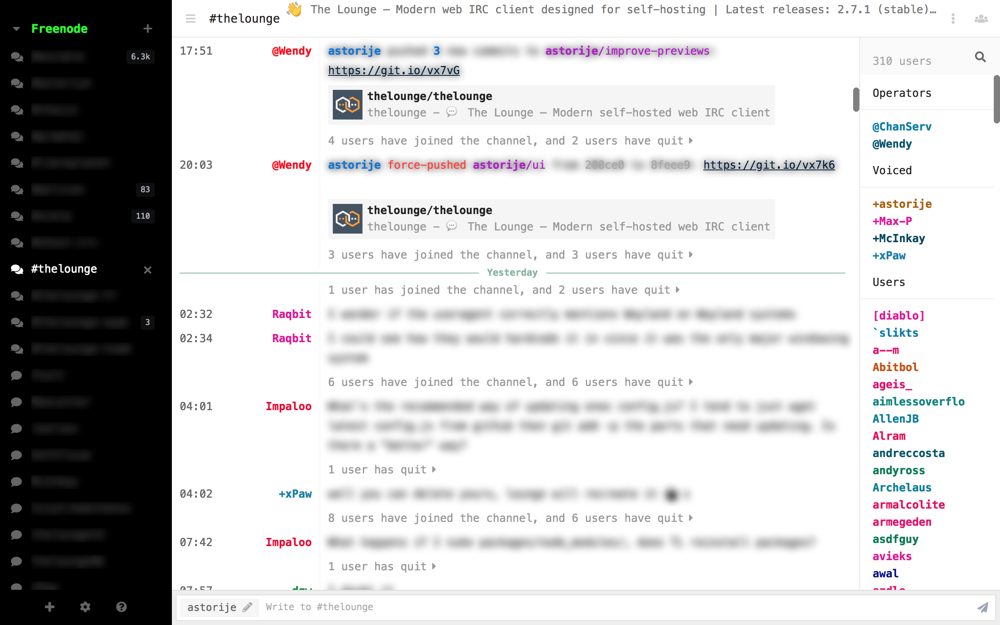

---

<h3 align="center">
  ⚠️ Crypto is currently looking for maintainers. ⚠️<br>
</h3>

---

<h1 align="center">
	Crypto theme for The Lounge
</h1>

<h3 align="center">
	Retro & high-contrast theme
</h3>

<p align="center">
	<a href="https://yarn.pm/thelounge-theme-crypto"></a>
	<a href="https://npm-stat.com/charts.html?package=thelounge-theme-crypto&from=2016-02-12"></a>
</p>

<p align="center">
	
</p>

## Installation

Install this theme with:

```sh
thelounge install thelounge-theme-crypto
```
